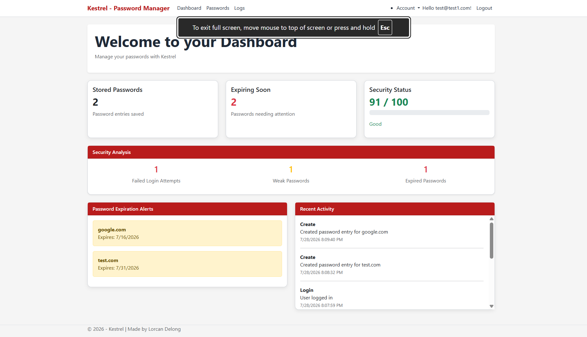
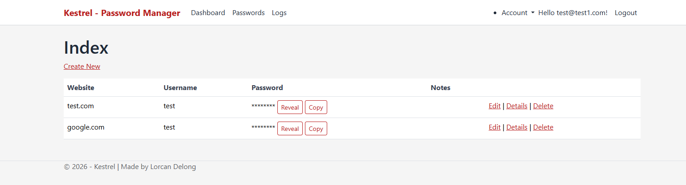
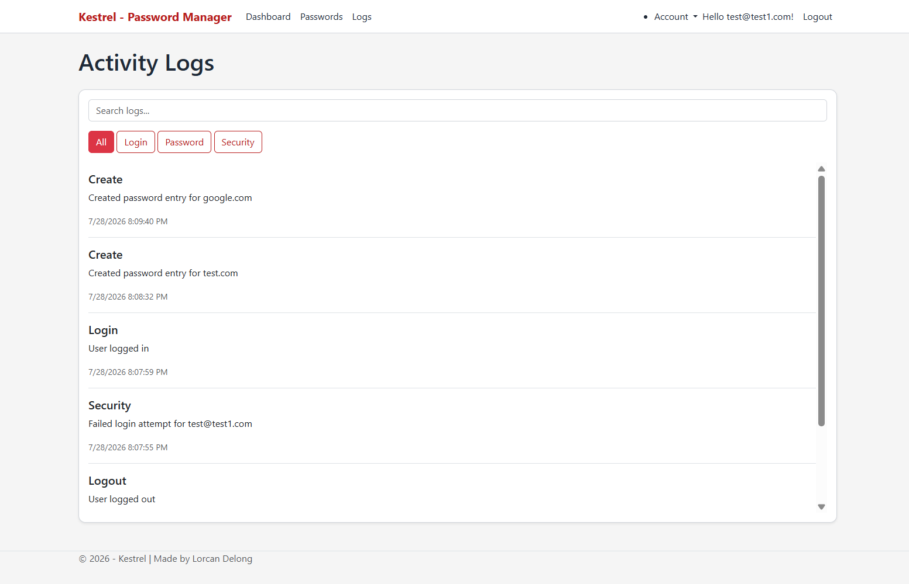

# Kestrel Password Manager

A security-focused password management application built with ASP.NET Core MVC. Kestrel Password Manager allows users to securely store, manage, and monitor their credentials using encryption, authentication, multi-factor authentication, and security auditing features.

## Features

- User account registration and authentication
- Secure password storage with encryption
- Password creation, editing, and deletion
- User-specific password management
- Password expiration tracking
- Password strength analysis
- Security score dashboard
- Multi-factor authentication (MFA) using authenticator apps
- Security activity logging
- Failed login attempt monitoring
- Login and logout event tracking

## Security Features

- ASP.NET Core Identity authentication
- Entity Framework Core database management
- SQLite database storage
- Encrypted password data
- Multi-factor authentication support
- User authorization controls
- Security event auditing
- Protection against unauthorized password access
- User-specific data isolation

## Technologies Used

- C#
- ASP.NET Core MVC
- Entity Framework Core
- SQLite
- ASP.NET Core Identity
- Razor Pages
- Bootstrap
- Git/GitHub
- Visual Studio

## Project Structure

Controllers/     Application controllers  
Models/          Database models and view models  
Views/           Razor views  
Data/            Database context and migrations  
Services/        Encryption and logging services  
Areas/Identity/  Authentication and MFA pages  

## Setup Instructions

### Requirements

- Visual Studio
- .NET SDK
- SQLite

### Installation

1. Clone the repository:

git clone https://github.com/yourusername/KestrelPasswordManager.git

2. Open the solution in Visual Studio.

3. Apply database migrations:

Update-Database

4. Run the application.

## Screenshots

### Dashboard

### Password Manger

### Activity Log

## Future Improvements

- Password generator
- Additional security notifications
- Cloud deployment
- Automated security testing
- Improved password sharing features
- Additional account recovery options

## License

This project is licensed under the MIT License.
